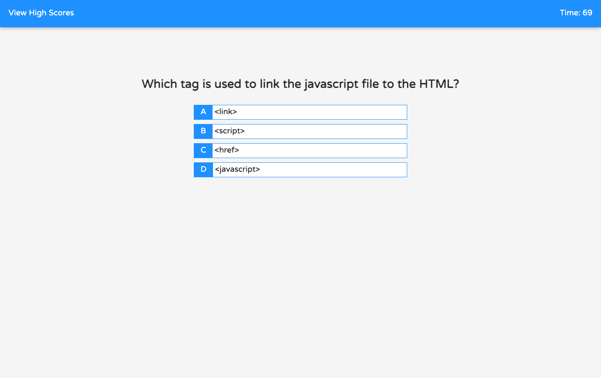

# hw4-codeQuiz

To create a quiz web app that has a timer and penalizes the player if they answer wrongily. Made it so that the questions will be shown randomly each playthrough, cycling through 6 different questions.

## Link to webpage!
[Code Quiz Webpage](https://sksmejn.github.io/hw4-codeQuiz/index.html)
## Landing Page

## Quiz Page

## Highscore Page

